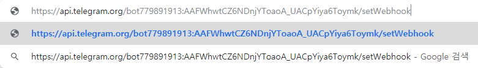
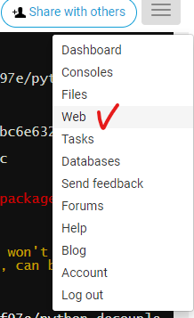
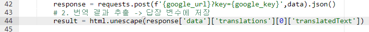

# 파이썬 챗봇 만들기

## 1. 개발환경 세팅

### 1.1 프로젝트 폴더 및 .gitignore생성

* 새로운 repository


붙여넣기


### 1.2 가상환경 생성 및 진입

* 가상환경 만들기

  ```bash
  바탕화면/telegram-bot
  $ python -m venv venv
  ```


* 가상환경 진입

  ```bash
  바탕화면/telegram-bot/
  $ source venv/Scripts/activate
  ```


* VSCode 자동 가상환경 진입 설정
  * 이 옵션을 설정하는 경우, 반드시 .vscode폴더가 있는 디렉토리에서 open with code 혹은 open folder로 진입을 해야 터미널을 새로 켤때 자동으로 가상환경 진입이 된다.
  * 자동으로 가상환경이 켜지지 않으면 당황하지 않고 source~activate 명령어를 직접 쳐서 가상환경에 진입하자.
  * **Ctrl + Shift + P -> Python : Select Interpreter -> 사용할 환경 선택**
  * 무조건 Telegram_bot 폴더에서 실행해야해


		* 설정이 완료되면 .vscode 폴더가 생긴다


```bash
telegram-bot/
	.vscode/
	venv/
	.gitignore
```


우리환경이 플라스크를 따라라


[flask quickstart](http://flask.palletsprojects.com/en/1.1.x/quickstart/#quickstart)


제일 하단에 껐다 켰다 하지 않기 위해


### 1.3 Flask 개발용 서버 실행

#### 1.3.1 Flask 공식문서로 시작하기

반드시 가상환경 진입 여부를 확인하고 설치하자. 명령어 좌상단의 (venv)

```bash
(venv)
$ pip install Flask
```

```bash

```

#### 1.3.2 서버실행을 간편하게

공식문서에 있는대로 flask run 명령어를 수행하면 서버가 실행된다. 하지만 이 경우엔 app.py의 내용을 수정하면 서버를 재실행해야 반영된다. 따라서 코드를 추가해서 이를 방지해보자.


[telegram](http://www.telegram.pe.kr/)

다운로드

쭉쭉 넘어가

github에서 repository만든다음에

그 폴더에서 git bash 엶


requirements.txt만들거야


pip list를 얼려서 requirements.txt 에 넣는다


## 2. Telegram 봇 생성 및 요청 보내기

#### 2.1 봇 만들기

* BotFather -> newbot -> name 입력 -> username 입력

bot father


* 토큰값 임시 저장하기(=>메모장)

  컴퓨터에서 제일 안전한곳?! ==> 메모장


#### 2.2 요청 보내보기

* 요청 보내보기

  `getme` 메서드를 사용해서 내봇에 대한 정보를 받아온다.

  ```dd
  https://api.telegram.org/bot779891913:AAFWhwtCZ6NDnjYToaoA_UACpYiya6Toymk/getMe
  ```

  ```bb
  [API 토큰]
  779891913:AAFWhwtCZ6NDnjYToaoA_UACpYiya6Toymk
  [API 요청주소]
  https://api.telegram.org/bot<token>/METHOD_NAME
  
  https://api.telegram.org/bot779891913:AAFWhwtCZ6NDnjYToaoA_UACpYiya6Toymk/getMe
  ```

  

* 결과값

  ```json
  {
  	"ok": true,
  	"result": {
  	"id": 779891913,
  	"is_bot": true,
  	"first_name": "youngflowey",
  	"username": "youngflowey_bot"
  	}
  }
  ```


## 3. 사용자에게 메세지 보내기

### 3.1 사용자의 ID값 알아내기

> 사용자에게 메세지를 보내려면 사용자의 고유한 ID값을 알아야 한다


result 비어있는 이유 : 사용한 사람x, 메세지 자체도 온게 x


메세지 들어온 정보 다 담겨있음

내 아이디 메모장에 저장

update_id : 챗이 하나하나 바뀜에 따라 달라짐


쿼리스트링으로 내보내야하기 때문에 ?붙여줌

여러개아이디 &

[sendMessage 샘플]
https://api.telegram.org/bot779891913:AAFWhwtCZ6NDnjYToaoA_UACpYiya6Toymk/sendMessage?chat_id=1033221297&text=안녕하세요


파이썬 으로 알아보기


실행

나한테만 보낼 수는없어

chat_id 바꿔 줘야해


이 개념 가지고 갈거야


이 프로젝트에게만 필요한 환경변수 만들기


생성!

일반적으로 환경변수 > 대문자 & _로 씀

띄어쓰기 ㄴㄴ


### 3.2 메세지 보내기

### 3.3 


# 4. Flask로 메세지 보내기!


write.html로 갈거야


/send로 보낼거야


요청 : get 요청( url치고 엔터 , html어떠한 정보 내놓으세요) / post 요청( 정보를 수정, 추가, 삭제해주세요 )

텔레그램측이 post로만 보내주기 때문에 post씀

타인에게 공개하지 않는 token정보 텔레그램측에 보내줄거니까 텔레그램만 내용을 전달할 수 있도록 만들어준다

주소창에 토큰을 붙여버려서 아무나 보내지 못함

# 4. ngrk

> 우리의 Flask 서버는 현재 로컬 환경에서 개발용 서버로 작동하고 있다. 그래서 텔레그램 측에 웹훅을 적용하기 위해 주소를 알려주더라도, 텔레그램 측에서 우리 서버 주소로 접근을 할 수가 없다.
>
> (사내 인트라넷에 글 올려놓고, 부모님께 접속해보라고 링크 던져주는 것과 마찬가지인 상황)
>
> 이를 해결하기 위해, 로컬 서버 주소를 임시로 public하게 열어주는 틀인 엔그룩(ngrok)을 사용해보자.

## 4.1 설치 및 파일 배치

* [ngrok공식 홈페이지](https://ngrok.com/download)
* 압축풀기 => ngrok.exe
* c드라이브 => student 파일로 복사 or 잘라내기

## 4.2 서버 실행

teminal에서 실행

cmd에서 할거야

git bash도 되지만 하다가 실수를 할 가능성이 높아


포트번호 5000 

임시로 접근할 수 있는 퍼블릭 주소 만들거야


주소 알려줘

내컴퓨터에 있는 로컬주소 공개 가능

다른사람도 이 주소로 접근할 수 있게 됨

텔레그램은 https만 지원함


텔레그램에게 알려줄 주소 

이제 웹훅을 걸어야해

내가 이주소 줄 테니깐 변동사항있으면 이주소로 알려줘

cmd 밑에 놔둬야해 지우면안돼! 건드리면 주소 바뀌어버림

https://api.telegram.org/bot779891913:AAFWhwtCZ6NDnjYToaoA_UACpYiya6Toymk/+setWebhook



https://api.telegram.org/bot779891913:AAFWhwtCZ6NDnjYToaoA_UACpYiya6Toymk/setWebhook?url=https://7c0af00e.ngrok.io/779891913:AAFWhwtCZ6NDnjYToaoA_UACpYiya6Toymk

텔레그램이 보내면 메세지 보내는 함수를 실행해야해 나만알고 있는 토큰을 텔레그램에게 알려줌

맨 뒤 텔레그램만 접근할 수 있게함


주소로 들어가면 웹훅 설정되었다고 나옴

사용자에게 메세지가 오면 텔레그램이 이 주소로 알려줌


- 터미널에서  ngrok 서버를 실행한다.

- 플라스크 개발 서버의 포트 번호의 기본값이 5000

  ```bash
  ngrok http 5000
  ```

- ngrok에서 만들어준 서버를 주소창에 입력해서 실행시켜서 확인

- 단, 프로그램을 껐다켜면 주소가 바뀐다. 이미 텔레그램 웹훅을 세팅해두었는데 엔그록 서버 주로가 바뀌면 또 다시 웹혹 설정을 해야한다. 따라서 큰 귀찮음을 방지하기 위해 엔그록 서버가 꺼지지 않도록 최소화 시켜놓고 개발을 진행하자.


메세지 보내고


#### 메아리 기능


#### 로또 번호


#### 번역


[google cloud api](https://cloud.google.com/apis/docs/overview?hl=ko)


키값 받아와서


안되면 api사용설정이 안된거


복사


이제 서버로 옮길거야


재생을 누르거나 app.py 입력


### 배포

[pythonanywhere](https://www.pythonanywhere.com/)





https://api.telegram.org/bot779891913:AAFWhwtCZ6NDnjYToaoA_UACpYiya6Toymk/setWebhook?url=https://youngflowey.pythonanywhere.com/779891913:AAFWhwtCZ6NDnjYToaoA_UACpYiya6Toymk

주소창에 입력


이제 앱에서 쓰면됨




